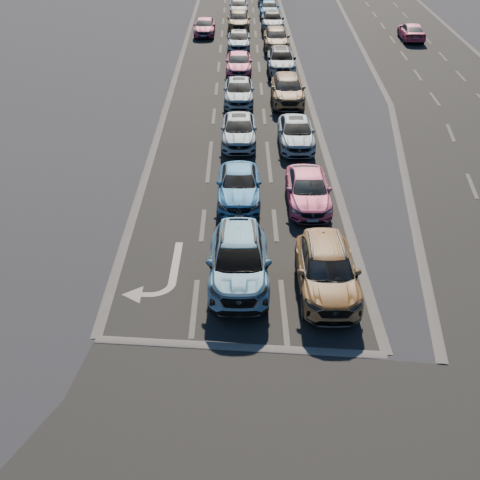
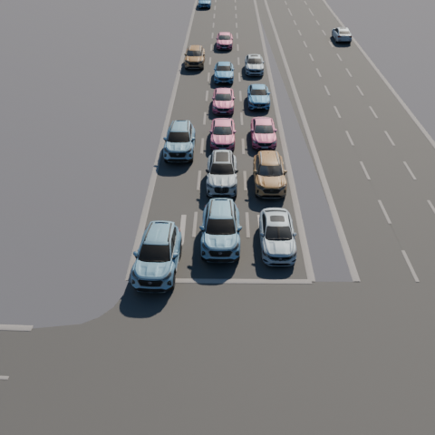
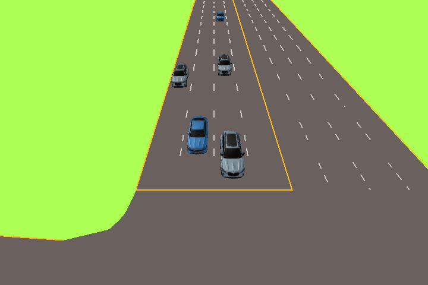
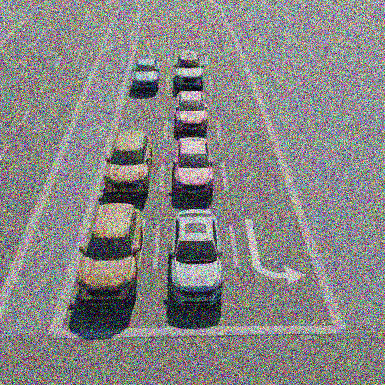

<!--
 * @Author: Maonan Wang
 * @Date: 2025-01-13 19:24:39
 * @Description: VLM for TSC
 * @LastEditors: WANG Maonan
 * @LastEditTime: 2025-07-21 20:47:54
-->
# 数据集介绍

## Beijing Beishahe

**空场景俯视图：**

**不同视角渲染效果：**

| BEV | 0 | 1 | 2 |
|-----------|-----------|-----------|-----------|
|  |  |  |  |
|  |  |  |  |

## Beijing Changjianglu

**空场景俯视图：**

**不同视角渲染效果：**

| BEV | 0 | 1 | 2 |
|-----------|-----------|-----------|-----------|
|  |  |  |  |
|  |  |  |  |

## Beijing Gaojiaoyuan

**空场景俯视图：**

**不同视角渲染效果：**

| BEV | 0 | 1 | 2 | 3 |
|-----------|-----------|-----------|-----------|-----------|
|  |  |  |  |  |
|  |  |  |  |  |

## Beijing Pinganli

**空场景俯视图：**

**不同视角渲染效果：**

| BEV | 0 | 1 | 2 | 3 |
|-----------|-----------|-----------|-----------|-----------|
|  |  |  |  |  |
|  |  |  |  |  |

## Beijing Yongrunlu

**空场景俯视图：**

**不同视角渲染效果：**

| BEV | 0 | 1 | 2 | 3 |
|-----------|-----------|-----------|-----------|-----------|
|  |  |  |  |  |
|  |  |  |  |  |

# 特殊交通路口场景

本仿真平台能够模拟多种复杂或突发的交通场景，为算法测试提供更贴近现实的环境。以下介绍四种关键的特殊场景：
- 道路无法通行：由于路障（如施工围栏、事故车辆、坠落物等）物理阻塞车道，即使信号灯为绿灯，受影响的车辆也无法通过该路段。
- 紧急特殊车辆优先通行：场景中出现具有优先通行权的特殊车辆（如警车、救护车、消防车）。平台需要支持识别这些车辆并为其提供通行便利（如延长绿灯、插入通行相位）。
- 道路车流量不平衡：同一方向不同路段的车流量存在显著差异（例如：南北方向，南侧入口车辆排队很长，而北侧入口车辆很少）。传统的对称放行策略可能导致车流大的一侧通行效率低下或空放时间浪费。
- 传感器（摄像头）损坏：交通感知系统中的摄像头可能因各种原因（物理损坏、环境干扰、数据传输问题）导致图像质量下降或信息缺失，影响目标检测与跟踪精度。平台模拟了多种常见的图像损坏类型。

## 前三种特殊场景示例

| 道路无法通行 (路障)  | 紧急特殊车辆 (警车) | 道路车流量不平衡 (南北向)  |
|-----------|-----------|-----------|
|  |  |  |

## 传感器（摄像头）损坏类型示例

下图展示了传感器损坏的模拟效果示例，包括：图像模糊、色彩失真、线状噪声、随机噪声等常见类型。这些损坏会影响基于视觉的交通流感知算法性能。

| 图像模糊 | 色彩失真 | 线状噪声 | 随机噪声 |
|-----------|-----------|-----------|-----------|
|  |  |  |  |

## 道路无法通行

由于突发情况导致道路无法通行的情况。下图展示了 `RL` 的方法在遇到突发情况导致的无法通行时，不能很好处理，仍然将绿灯给不能通行的方向：

   

下面是每个方向渲染得到的画面，可以看到由于路障的存在，导致南侧方向一段时间内无法通行：

| BEV       | North     | East      | South     | West      |
|-----------|-----------|-----------|-----------|-----------|
|  |  |  |  |  |